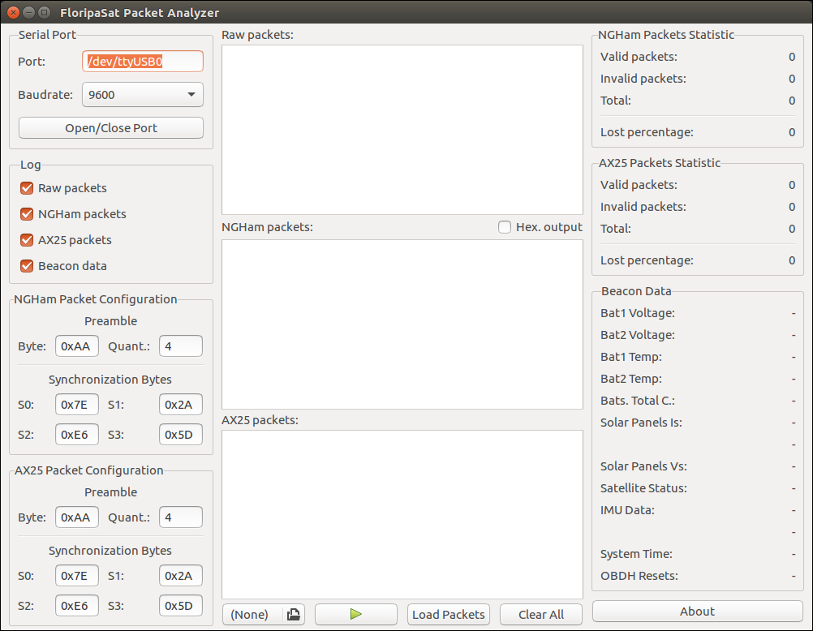

# FloripaSat Packet Analyzer

This software decodes incoming NGHam and AX25 packets over the serial port. It also allows the search and decoding of packets in a binary file (The output of the GNURadio block chain).

## Dependencies

* libgtkmm-3.0-dev

## GUI Design

* Glade 3.18.3

## References

The source code of this software can be found in [GitHub](https://github.com/floripasat/grs/tree/master/FloripaSat-Packet-Analyzer).

The official website of the project is [www.floripasat.ufsc.br](http://www.floripasat.ufsc.br/).
